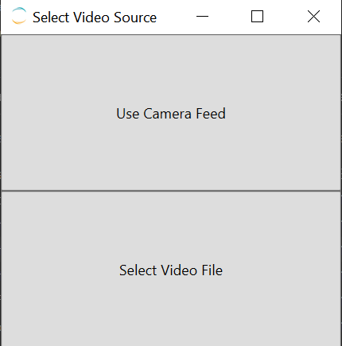
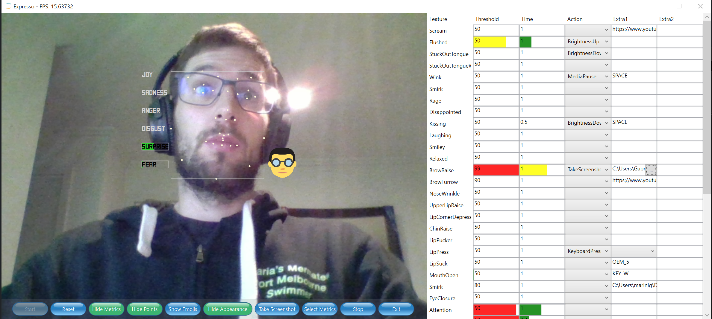
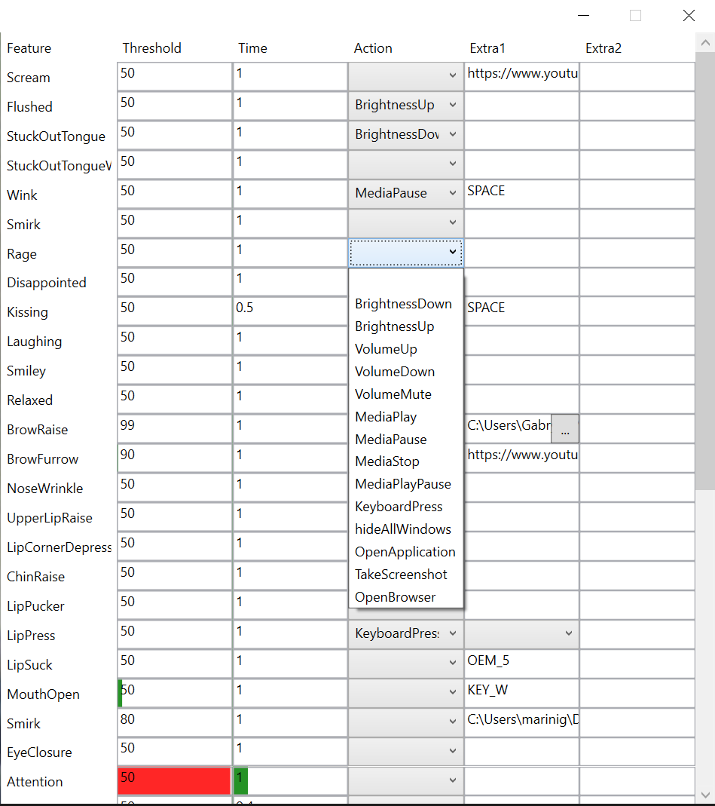

# Expresso - Windows control with Facial gestures
This is a little fun project developed as a final assignment for the course [INFO90003 - Designing Novel Interaction](https://handbook.unimelb.edu.au/2018/subjects/info90003)
at the University of Melbourne.

The project uses [Affectiva](https://www.affectiva.com/) to detect facial expressions and emojis in real time. The app has been recently updated to get video feed from file and process
every frame in it.

# Instructions
There should be a release in the repository but if there is not, you'll find the pre-compiled exe in the `AffectivaWPF/bin/x64/Release` folder.

Once started you should be greeted with this window:


## Camera Feed
The camera feed should look something like this:



# Features and facial expressions
There are three categories of expressions:

| Seven Basic Emotions                              | Action Units                                                                                                                                                                                                                                                                                                                        | Other              |   |   |
|---------------------------------------------------|-------------------------------------------------------------------------------------------------------------------------------------------------------------------------------------------------------------------------------------------------------------------------------------------------------------------------------------|--------------------|---|---|
| Contempt Surprise Anger, Sadness Disgust Fear Joy | Scream Flushed Stuck Out Tongue Wink Smirk Rage Disappointed Kissing Laughing Smiley Relaxed Brow Raise Brow Furrow Nose Wrinkle Upper Lip Raise Lip Corner Depress Chin Raise Lip Pucker Lip Press Lip Suck Mouth Open Eye Closure Eye Widen Cheek Raise Lid Tighten Dimpler Lip Stretch Jaw Drop Inner Brow Raise Smile Attention | Engagement Valence |   |   |
|                                                   |                                                                                                                                                                                                                                                                                                                                     |                    |   |   |
|                                                   |                                                                                                                                                                                                                                                                                                                                     |                    |   |   |

There are currently 14 actions registered in the app, implemented with the help of Windows Hooks in .NET and the `user32.dll` library.
I tried to keep the code modular so that new actions could be hooked up easily. The class `AffectivaActions` is where these actions are added to the list:
```cs        
private AffectivaActions()
{
      actionsFunction.Add("BrightnessDown", (handle, param1, param2) =>
      {
          Console.WriteLine("BRIGHTNESS DOWN");
          HookActions.BrightnessDown(handle);
          return true;
      });
      
      actionsFunction.Add("BrightnessUp", (handle, param1, param2) =>
      {
          Console.WriteLine("BRIGHTNESS UP");
          HookActions.BrightnessUp(handle);
          return true;
      });
...
}
```

Adding new actions is as easy as adding a tuple (ActionName, CallbackMethod) to the `actionsFunction` list.

The Affectiva features added in a similar way where each feature has a Type (Emoji, Emotion, Expression) an ID and a DisplayName. The empty strings below would become the name of the action to be performed when triggered. In order to trigger an action a feature as two values that need to be met:
- Threshold (default=50)
- Time (default 1)
An action gets triggered when the feature strength is over Threshold for Time seconds so in this example if Affectiva detects BrowseUp with an accuracy of over 50 for 1 second its correspondign action will be executed.  

```cs
...

featuresActions.Add(new AffectivaFeature(AffectivaFeature.FeatureType.Emoji,"scream", "Scream", "", 50, 1));
featuresActions.Add(new AffectivaFeature(AffectivaFeature.FeatureType.Emoji,"flushed", "Flushed", "", 50, 1));
featuresActions.Add(new AffectivaFeature(AffectivaFeature.FeatureType.Emoji,"stuckOutTongue", "StuckOutTongue", "", 50, 1));
featuresActions.Add(new AffectivaFeature(AffectivaFeature.FeatureType.Emoji,"stuckOutTongueWinkingEye", "StuckOutTongueWinkingEye", "", 50, 1));
featuresActions.Add(new AffectivaFeature(AffectivaFeature.FeatureType.Emoji,"wink", "Wink", "", 50, 1));
...

```



# Screenshot 


# YouTube Presentation
[](https://www.youtube.com/watch?v=fw9QCx4QEHs)

