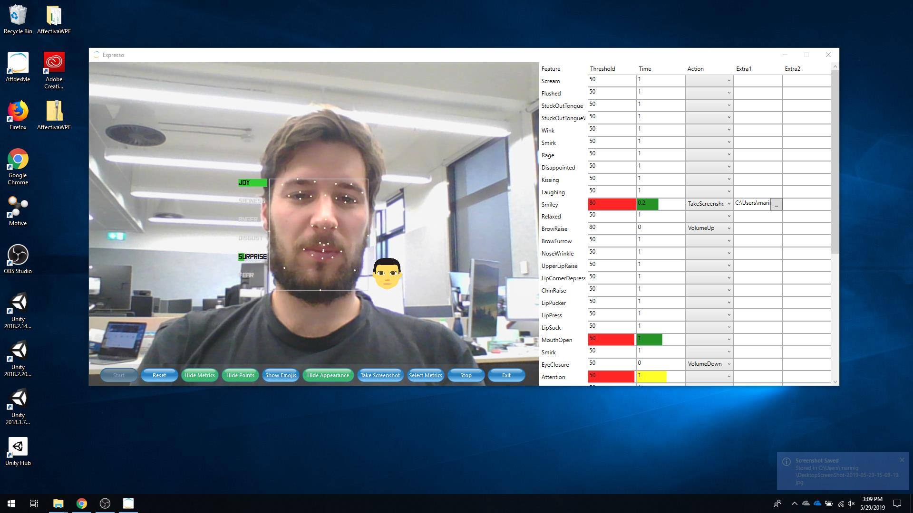

# Expresso - Windows control with Facial gestures
This is a little fun project developed as a final assignment for the course [INFO90003 - Designing Novel Interaction](https://handbook.unimelb.edu.au/2018/subjects/info90003)
at the University of Melbourne.

The project uses [Affectiva](https://www.affectiva.com/) to detect facial expressions and emojis in real time. The app has been recently updated to get video feed from file and process
every frame in it.

# Screenshot 

# YouTube Presentation

